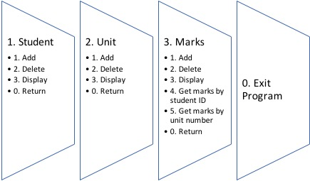

# Student Marks System in Java

## Introduction

The student marks system, a primary data management system, is used to manage the student data. It is used to store student information, unit information, and student marks record from different units. This project is the foundation of the data management system with several functions to perform various operations on the data. Moreover, this project aims at providing a user-friendly interface to enhance the user experience.
 
Managing the data has become an integral part of several organisations. A robust software becomes a necessity to improve work efficiency. Furthermore, data representation and data manipulation are becoming critical criteria in every organisation. Software users demand additional features which have inbuilt methods to represent and manipulate the data. Organisations require additional features with the growth in their business and customer size. Therefore, new versions of the software must incorporate all the necessary functions as per the client demand. Adding new features to the existing software model can disrupt the development process if the current software structure is unorganised. Therefore, structuring the code with proper semantics is essential for the future development of the project.
 
The student marks system project is a data management software designed in Java to manage the student data. User interface and key functionalities to manipulate the data is the prime focus of the project. Student information, unit information and student marks are the principal classes of the project. A data file with the respective name stores the data of the respective classes. The data can be retrieved and deleted; additional data is added and stored for each of these classes after the execution of the main program. Users are provided with the options to perform different functions embedded in the software. These options are categorised further to manage student, unit, and marks data. Each of the options mentioned above has sub-options related to add, display and delete data. Additional features are embedded in some classes which provide more functionalities in the student marks system. Moreover, the arrangement of the software code provides an additional scope to develop more features in the software in the future.
 
The report on student marks system project provides a brief overview of the development of the project. It includes information about the importance of user interface and describes its development. Furthermore, this report provides an explanation of the structure of the project with the code samples along with the execution results in the terminal window. This report also describes several methods, used in this project, to manipulate the student data. Moreover, this report presents the java technical aspects used in this project and scope for the future development of the project.

## Project Aim and Objectives

The student marks system project aims at developing a software program which enables the storage and retrieval of student information along with their marks.
 
Following are the objectives of the project:
* Add, display and delete all the relevant student records
* List the marks for all the units by student ID number
* List the student information and marks for a unit by unit number
* Calculate the average of the marks of all the students in a unit
* External storage of student, unit and, marks information
* Design a user-friendly interface by categorising each sub-function
* Arrange the code in relevant files by equally distributing the code


## User interface

A user interface (UI) determines the ease with which the user can navigate different parts of the software. UI provides the user with different methods which can be useful to perform different functions with the data available. This project focuses more on the development of a user-friendly UI at the same time focusing on the user experience. The usability of the software depends upon the UI and therefore it is essential to consider a user-friendly approach during software development.
 
This project consists of three important interfaces: Student, Unit, and Marks. Each of these interfaces consists of three important functions: add, delete, and display. The categorisation of the functions provides an easy access to different methodologies and makes the user aware of the type of operation. Moreover, categorising the functions provides a better user experience where the user does not need to sort out the method needed from a list of all the methods involved in the project listed together.



By categorising the functions separately, it becomes easier for the user to read the particular functions involved in the respective section of the program. The program displays a menu providing instructions to obtain the choice from the user. Once the user has selected the appropriate choice, the program calls another sub-menu relevant to the category. The user can perform all the relevant functions mentioned in the sub-menu of the respective section and enter numeral 0 to return back to the main program. The user can end the main program by entering the numeral 0 in the prompt during the main menu. The program keeps on running unless the user exits by entering the numeral 0.

## Program structure and algorithm

While designing the layout of the project, it is very much essential to consider the program structure and the program algorithm. Ensuring a proper structure of the code is essential to develop the project and add more features. It also becomes easier for a programmer who has not designed the software to maintain the code. Therefore, all the code relevant to a type of function in student marks system was arranged in their respective files. While doing this, it is necessary to consider the flow of the statements. Therefore, the following algorithm is implemented:
 
1. Read the data from all the files and store it in the respective array list.
2. Display the menu.
3. Take an input from the user.
4. If user enters 0 go to step 8 else go to step 5.
5. Display the sub-menu as per user choice.
6. Take the input from the user to perform user selected functions.
7. If the user enters 0, display main menu go to step 2.
8. End program.


## Code Functionalities

`Student.java` is the class that is used to instantiate student objects. It consists of five attributes. The variables have a private visibility modifier. 

```
private int studentID;
private String studentFirstName;
private String studentLastName;
private String studentMajor;
private String studentNationality;
```

A constructor is used which takes student ID, first name, last name, major, and nationality as parameters. The java reserved word `this` allows the object to refer to itself.

```
public Student(int studentID, String studentFirstName, String studentLastName, String studentMajor, String studentNationality){
	this.studentID = studentID;
	this.studentFirstName = studentFirstName;
	this.studentLastName = studentLastName;
	this.studentMajor = studentMajor;
	this.studentNationality = studentNationality;
}
```

Considering student ID to be the most important attribute in this class, a get method is used to obtain the value of student ID for that particular object. The purpose for using the private visibility modifier and getter and setter methods is to maintain the principle of encapsulation.

```
public int getStudentID(){
	return studentID;
}
```
A `toString()` method is also declared in this class which helps to retrieve the information related to the values of the instance variables of the objects. It is very much useful for reading and writing the file.

```
public String toString(){
	String summary = "";
	summary += studentID + "\t";
	summary += studentFirstName + "\t";
	summary += studentLastName + "\t";
	summary += studentMajor + "\t";
	summary += studentNationality;

	return summary;
}
```

Similar code methods are used in the `Unit.java` and `Marks.java` to perform the required functions.

`StudentCollection.java` is the class that performs all the functions such as add, delete and display student data. It maintains an Array List to store the student data.

```
ArrayList<Student> studentList = new ArrayList<Student>();
```

### Add Method

`StudentCollection.java` consists of add method which asks the user for input and creates a student object and adds it to the array `studentList`.

```
public void addStudent(){
	System.out.print("\nStudent ID: ");
	sid = scan.nextInt();

	System.out.print("\nFirst Name: ");
	scan.nextLine();
	firstName = scan.nextLine();

	System.out.print("\nLast Name: ");
	lastName = scan.nextLine();

	System.out.print("\nMajor: ");
	major = scan.nextLine();

	System.out.print("\nNationality: ");
	nationality = scan.nextLine();

	student = new Student(sid,firstName,lastName,major,nationality);
	studentList.add(student);

	System.out.println("Student added.");
}
```
The `.add()` is a method of `ArrayList<E>` class. This creates a collection of the student object when the `addStudent()` method is called in the main function. A similar method is used in `UnitCollection.java` and `MarksCollection.java`.

### Display Method

User experience is of prime importance in this project. Therefore, a display method helps the user to check the stored data. The data can be displayed by calling in the `toString()` method of the object. In the `StudentCollection.java`, the array list is iterated, and every student object stored in the array list is displayed in the terminal using `System.out.println()` statement.

```
public void displayStudent(){
	int idx = 0;
	while(idx < studentList.size()){
		System.out.println(studentList.get(idx));
		idx++;
	}
}
```
In the code given above, a while loop is used to iterate through the array list. A for loop could have as well been used. An array list method `.get()` is used to retrieve student object from the array list. A similar procedure is used in the `UnitCollection.java` and `MarksCollection.java`.

In addition to displaying the entire data, MarkCollection.java is embedded with two special methods which display marks of the student with student ID and unit number. 

```
public void displayMarksByStudentID(){
	ArrayList<Marks> outputMarks = new ArrayList<Marks>();
	System.out.print("\nEnter student ID: ");
	int student_id = scan.nextInt();
	int idx = 0;

	for(int i=0; i<marksList.size();i++){
		if(student_id == marksList.get(i).getStudentID()){
			outputMarks.add(marksList.get(i));
		}
	}

	if(outputMarks.isEmpty()){
		System.out.println("\nInvalid Input");
	}else{
		System.out.println("\n\n\n------------------------------");
		System.out.println("Unit\tSID\t\tMarks");
		System.out.println("------------------------------");
		while(idx < outputMarks.size()){
			System.out.println(outputMarks.get(idx));
			idx++;
		}
		System.out.println("------------------------------\n\n");
	}
}
```
Once the input is taken, then the above code matches the student ID with the student ID attribute of the object. To ensure that the student ID entered is correct, it uses a condition in which is uses an array method `.isEmpty()` to check if the new array list is empty. If this condition is true, then user gets a message saying invalid input. Otherwise, it again iterates through the list and displays all the object present in the array list.

### Delete Method

A delete method is used to remove the objects out of the array list. Delete method may slightly vary in `StudentCollection.java`, `UnitCollection.java`, and `MarksCollection.java`, but the logic remains the same. It is only the input required to sort the list and obtain the object is different. In `StudentCollection.java`, only student ID is taken as an input from the user, whereas, in `MarksCollection.java`, student ID and unit number are taken as an input. In the latter case, while sorting the array list, a conditional operator `&&` is used to check if the student ID and unit number match. This condition is implemented so that, only a particular unit of a particular student is deleted and not all the unit with the unit number or all the student entry with student ID.

```
if(student_id==marksList.get(i).getStudentID() && unit_no == marksList.get(i).getUnitNo())
```
The method in StudentCollection.java is as follows:

```
public void deleteStudent(){
	System.out.print("\nEnter Student ID: ");
	int student_id = scan.nextInt();
	boolean flag = true;
	for(int i = 0; i < studentList.size(); i++){
		if(student_id == studentList.get(i).getStudentID()){
			studentList.remove(i);
			flag = false;
		}
	}
	if(flag){
		System.out.println("Incorrect Information.");
	}
}
```
In the above code, array list method `.remove()` is used to remove the object from the list. A variable of data type boolean is used to check if operation is performed on the array list.

### Read data method
Java provides `java.util.Scanner` library to read a file. The file format used in this project is a `.dat` format. The function is called at the beginning of the main program. The function reads the file and stores the value in variables which are passed as arguments to the object instantiation. These objects are then added to the array list. Therefore, if the data file consists of pre-existing data, it is scanned and available when the program runs. This enables the user to retrieve the stored data and start again from when the program was last terminated. Following code is used to read the data in `StudentCollection.java`: 

```
public void readStudentData() throws FileNotFoundException{
	String studentFile = "student.dat";
	Scanner sc = new Scanner(new File(studentFile));
	System.out.println("\n**Reading input file " + studentFile + " .. ");
	while(sc.hasNext()){
		sid = sc.nextInt();
		firstName = sc.next();
		lastName = sc.next();
		major = sc.next();
		nationality = sc.next();

		student = new Student(sid,firstName,lastName,major,nationality);
		studentList.add(student);
	}
	sc.close();
	System.out.println("|||||||||||||||||||||||||| 100 %\n");
	System.out.println("Scanning " + studentFile + " complete.\n");
}
```
In the code above, a `FileNotFoundException` is thrown whenever the code runs and there is a `try-catch` method implemented in the main function to catch the exception.

### Write Data Method

In the write method, a `PrintWriter` class is used to create an output file object in which the data is written. A loop in iterated and every value from the array list is written in the data file. The write data method is used at the end of the main function before the user exits the program. It is as follows:

```
public void writeStudentData() throws IOException{
	String studentFile = "student.dat";
	PrintWriter outputFile = new PrintWriter(new FileWriter(studentFile));
	System.out.println("\n** Writing the data in the file " + studentFile + " .. ");
	int idx = 0;
	while(idx < studentList.size()){
		outputFile.println(studentList.get(idx));
		idx++;
	}
	outputFile.close();
	System.out.println("|||||||||||||||||||||||||| 100 %\n");
	System.out.println("Writing " + studentFile + " complete.\n");
}
```
## How to run program

Compile and run `StudentMarksSystem.java`.
The program consists pre-existing data in the `.dat` file. User may erase the pre-existing data manually or through the program. Make sure that `unit.dat`, `student.dat`, and `marks.dat` files are present in the same directory as all the program files.
